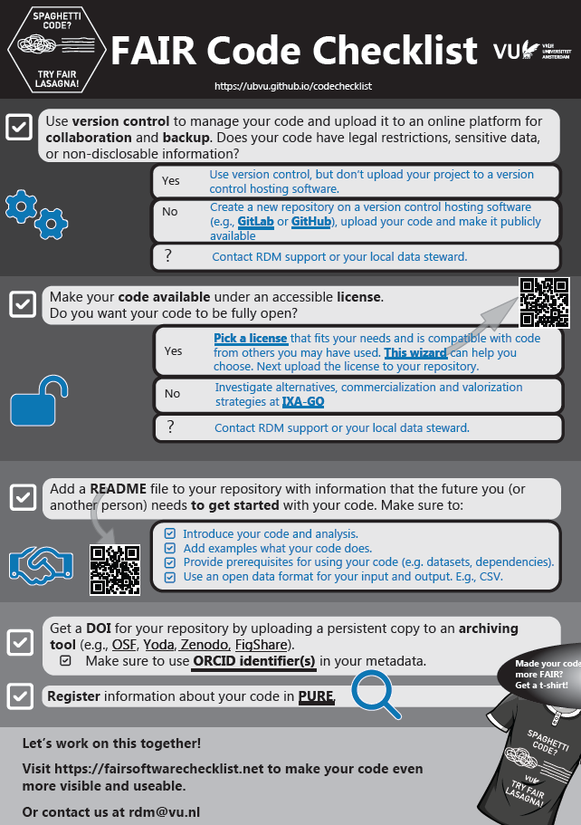

# FAIR Code Checklist

✨ This checklist helps you to make your code (more) Findable, Accessible, Interoperable and Reusable. ✨

The FAIR principles originated in data management, but are as significant when writing a script, function, analysis, toolbox (any sort of code). Recently the FAIR principles have been rigorously applied to software in a [paper](https://dx.doi.org/10.3233/DS-190026)

💡 To simplify your task, we created a checklist with easy-to-follow instructions that guide you through the process of making your code more FAIR. 💡

🍝 Spaghetti code is a disorganized, tangled, and difficult-to-follow programming structure that hinders reproducibility during and after research by making it challenging to debug, interpret, or extend.

[Planning ahead](https://vu.nl/en/research/portal/research-impact-support-portal/incorporate-your-software-management-plan) helps to improve and structure the code you produce and share.

Therefore our catchphrase is: **SPAGHETTI CODE? TRY FAIR LASAGNA**. 🍝

# Contributions
🎉 This project is still in development, and we’d love your feedback! Feel free to share your thoughts via the issue tracker or by commenting on the checklist. 🎉

# License
The FAIR CODE Checklist is published under the [CC-BY license](LICENSE).

This checklist builds upon Utrecht University's [cheatsheet](https://utrechtuniversity.github.io/FAIR-Cheatsheets/) and https://fair-software.eu/
